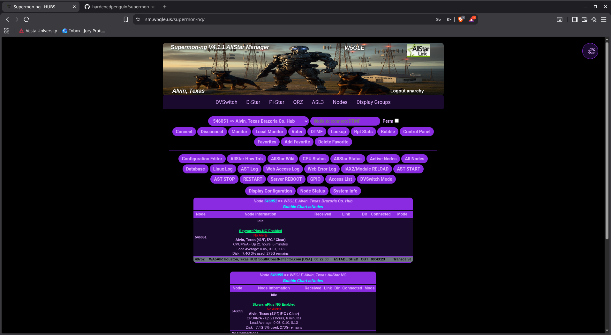

# Supermon-NG - Modern AllStar Link Management Dashboard




A modern, responsive web-based management interface for AllStar Link nodes, built with Vue.js 3 and PHP 8.

## ✨ Features

- **Modern Vue.js 3 Frontend** - Responsive, fast, and intuitive interface
- **WebSocket Real-time Updates** - Live node status updates via WebSocket (no polling)
- **DVSwitch Mode Switcher** - Switch between DMR, YSF, P25, D-STAR, and NXDN modes
- **Real-time Node Monitoring** - Live status updates, connections, and statistics
- **Node Status Management** - Automated Asterisk variable updates
- **User Authentication** - Secure login system with role-based permissions
- **System Information** - CPU, memory, disk usage, and temperature monitoring
- **Configuration Management** - Web-based editing of configuration files
- **Custom Theming** - Support for custom header backgrounds and text colors
- **Log Viewing** - Access to system and application logs
- **Control Panel** - Execute AllStar commands remotely
- **Multi-node Support** - Manage multiple AllStar nodes from a single dashboard

## 📋 System Requirements

- **Operating System**: Debian 11+ or Ubuntu 20.04+ (ASL3+ compatible)
- **PHP**: 8.0+ with extensions: `sqlite3`, `curl`, `mbstring`, `json`
- **Apache**: 2.4+ with modules: `rewrite`, `proxy`, `proxy_http`, `proxy_wstunnel`, `headers`, `expires`, `ssl`
- **RAM**: 512MB minimum, 1GB recommended
- **Storage**: 200MB free space
- **AllStar Link**: ASL3+ installation with Asterisk

## 🚀 Quick Start

### Installation

```bash
cd $HOME
wget https://github.com/hardenedpenguin/supermon-ng/releases/download/V4.1.5/supermon-ng-V4.1.5.tar.xz
tar -xJf supermon-ng-V4.1.5.tar.xz
cd supermon-ng
sudo ./install.sh
```

The installer automatically handles:
- Dependency installation (PHP, Apache modules, ACL tools)
- Apache configuration with proxy and WebSocket support
- Security setup (sudoers, file permissions, ACLs)
- Systemd services for backend, WebSocket, and node status updates
- Frontend deployment
- **`user_files/allmon.ini` on new installs**: Generated from your local Asterisk `rpt.conf` (node stanzas) and `manager.conf` (AMI). Any existing `allmon.ini` is backed up to `allmon.ini.bak.<timestamp>` before it is replaced.

**Options:**
- `--skip-apache`: Skip Apache configuration (for Nginx or custom setups)
- `--help`: Show all available options

### Initial Configuration

1. **Configure nodes (`allmon.ini`)**: Fresh installs already create `/var/www/html/supermon-ng/user_files/allmon.ini` from Asterisk. Open the file to verify AMI host, user, and node list; edit if your manager users or nodes differ from what was detected. To rebuild later: `sudo php /var/www/html/supermon-ng/scripts/generate_local_allmon.php --force` (backs up the current file first).
   ```ini
   [12345]
   host=localhost:5038
   user=admin
   passwd=your_secure_password
   menu=yes
   system=Nodes
   default_node=12345
   ```

2. **Create User Account**:
   ```bash
   cd /var/www/html/supermon-ng
   sudo ./scripts/manage_users.php add username password
   ```

3. **Set Permissions**: Edit `/var/www/html/supermon-ng/user_files/authusers.inc` to grant permissions to your user

4. **Access Dashboard**: Open `http://your-server-ip/supermon-ng/` in your browser

## ⚙️ Configuration

### Node Configuration

Edit `/var/www/html/supermon-ng/user_files/allmon.ini` to add your AllStar nodes. See the installation section above for the format.

### Optional Features

**Custom Header Background:**
- Place image file named `header-background.jpg` (or `.png`, `.gif`, `.webp`) in `/var/www/html/supermon-ng/user_files/`
- Recommended size: 900x164 pixels
- System checks for custom header first, falls back to default `background.jpg` if not found

**Custom Header Text Colors:**
- Edit `/var/www/html/supermon-ng/user_files/global.inc`
- Configure colors for:
  - `$CALLSIGN_COLOR` - Callsign text color
  - `$TITLE_LOGGED_COLOR` - Title text when logged in
  - `$TITLE_NOT_LOGGED_COLOR` - Title text when not logged in
- Can use color names, hex codes, or RGB values

**Node Status Updates:**
- Configure via web dashboard (Node Status button) or create `/var/www/html/supermon-ng/user_files/sbin/node_info.ini`
- Enable timer: `sudo systemctl enable supermon-ng-node-status.timer && sudo systemctl start supermon-ng-node-status.timer`
- **Weather Alerts**: Only SkywarnPlus-NG is supported for weather alerts displayed in node tables
  - Configure `API_URL` in `node_info.ini` to point to your SkywarnPlus-NG instance
- **Weather and System Info Display**: Requires `saytime_weather` module to be loaded in Asterisk
  - Weather and system information will only display in node tables if `saytime_weather` is available
  - Install and configure `saytime_weather` module for your Asterisk installation

**DVSwitch Mode Switcher:**
- Copy `/var/www/html/supermon-ng/user_files/dvswitch_config.yml.example` to `dvswitch_config.yml`
- Configure talkgroups for each mode (DMR, YSF, P25, D-STAR, NXDN)
- **BM / TGIF credentials** belong in a top-level `credentials:` map (server file only). Each talkgroup row uses `profile:` plus `tg:` (the suffix after `!`). The API and browser only see aliases and opaque `smngtg1:` tune tokens, not passwords.
- Optional **`network:`** on each row (e.g. `BrandMeister`, `TGIF`): when a mode lists more than one network name, the UI adds a **DMR network** (or **Network**) dropdown so operators pick BM vs TGIF before choosing the talkgroup.
- You can add additional credential profiles the same way (for example **STFU**) so those credentials also never appear in the browser. Profiles may optionally define `format` if the internal tune string differs from `{password}@{server}:{port}!{tg}`.
- For multi-node setups, configure `abinfo_file` or `abinfo_port` in `allmon.ini`:
  ```ini
  [1998]
  host=127.0.0.1:34001
  abinfo_port=34001
  ```
- Per-node configs: Create `dvswitch_config_{nodeId}.yml` for node-specific settings
- Requires `DVSWITCHUSER` permission in `authusers.inc`

### User Management

```bash
cd /var/www/html/supermon-ng

# Create user
sudo ./scripts/manage_users.php add username password

# List users
sudo ./scripts/manage_users.php list

# Change password
sudo ./scripts/manage_users.php change username newpassword

# Delete user
sudo ./scripts/manage_users.php remove username
```

### Role-Based Permissions

Edit `/var/www/html/supermon-ng/user_files/authusers.inc` to configure permissions:

- **Basic**: `$CONNECTUSER`, `$DISCUSER`, `$MONUSER` - Connect/disconnect/monitor nodes
- **Advanced**: `$DTMFUSER`, `$RSTATUSER`, `$FAVUSER` - DTMF, stats, favorites
- **DVSwitch**: `$DVSWITCHUSER` - Access to DVSwitch mode and talkgroup switching
- **Administrative**: `$CTRLUSER`, `$CFGEDUSER`, `$SYSINFUSER` - Control panel, config editor, system info

**Single User Setup:**
```bash
sudo sed -i 's/"anarchy"/"yourusername"/g' /var/www/html/supermon-ng/user_files/authusers.inc
```

## 🔄 Updates

### Quick Update

```bash
cd $HOME
wget https://github.com/hardenedpenguin/supermon-ng/releases/download/V4.1.5/supermon-ng-V4.1.5.tar.xz
tar -xJf supermon-ng-V4.1.5.tar.xz
cd supermon-ng
sudo ./scripts/update.sh
```

**Upgrading and `allmon.ini`:** Use `update.sh` when moving to a newer release. It keeps your existing `user_files/allmon.ini` and only auto-generates that file if it is **missing** (for example after an incomplete copy). Do **not** run `install.sh` over an existing site to upgrade—`install.sh` is for fresh deployments and will regenerate `allmon.ini` from Asterisk (after backing up the previous file), which can replace a carefully edited configuration.

**Options:**
- `--skip-apache`: Preserve custom Apache configuration
- `--force`: Update even if versions match

The update script:
- ✅ Preserves all user configuration files (`allmon.ini`, `authusers.inc`, `.htpasswd`, `dvswitch_config*.yml`, etc.)
- ✅ Leaves `allmon.ini` unchanged when upgrading; only generates it if the file is not present
- ✅ Creates automatic backups before updating
- ✅ Updates system services and dependencies
- ✅ Validates configuration and restarts services
- ✅ Preserves WebSocket and DVSwitch configurations

**Check Current Version:**
```bash
sudo /var/www/html/supermon-ng/scripts/version-check.sh
```

## 🛠️ Management

### Service Management

```bash
# Backend service
sudo systemctl status supermon-ng-backend
sudo systemctl restart supermon-ng-backend

# WebSocket service (real-time updates)
sudo systemctl status supermon-ng-websocket
sudo systemctl restart supermon-ng-websocket

# Node status timer (if configured)
sudo systemctl status supermon-ng-node-status.timer

# Apache
sudo systemctl status apache2
sudo systemctl restart apache2
```

### Log Files

- **Apache**: `/var/log/apache2/supermon-ng_error.log`, `/var/log/apache2/supermon-ng_access.log`
- **Backend**: `sudo journalctl -u supermon-ng-backend -f`
- **WebSocket**: `sudo journalctl -u supermon-ng-websocket -f`
- **Node Status**: `/var/log/supermon-ng-node-status.log`
- **Asterisk**: `/var/log/asterisk/messages`

### Configuration Files

- **Node Config**: `/var/www/html/supermon-ng/user_files/allmon.ini`
- **User Permissions**: `/var/www/html/supermon-ng/user_files/authusers.inc`
- **Global Settings**: `/var/www/html/supermon-ng/user_files/global.inc`
- **DVSwitch Config**: `/var/www/html/supermon-ng/user_files/dvswitch_config.yml`
- **Apache Config**: `/etc/apache2/sites-available/supermon-ng.conf`

## 🐛 Troubleshooting

### Common Issues

**Site not accessible:**
```bash
sudo systemctl status apache2
sudo systemctl status supermon-ng-backend
sudo tail -f /var/log/apache2/supermon-ng_error.log
```

**502 Bad Gateway:**
```bash
sudo systemctl start supermon-ng-backend
sudo systemctl enable supermon-ng-backend
sudo journalctl -u supermon-ng-backend -f
```

**WebSocket not connecting:**
```bash
sudo systemctl status supermon-ng-websocket
sudo systemctl restart supermon-ng-websocket
sudo journalctl -u supermon-ng-websocket -f
sudo apache2ctl configtest
# Ensure proxy_wstunnel module is enabled: sudo a2enmod proxy_wstunnel
```

**Permission issues:**
```bash
sudo chown -R www-data:www-data /var/www/html/supermon-ng
sudo chmod -R 755 /var/www/html/supermon-ng
sudo setfacl -R -m u:www-data:r /var/log/asterisk/
```

**Apache configuration test:**
```bash
sudo apache2ctl configtest
sudo a2enmod proxy proxy_http proxy_wstunnel rewrite headers substitute
```

**AMI connection failures:**
```bash
sudo systemctl status asterisk
sudo asterisk -rx "manager show connected"
```

## 📋 Quick Reference

```bash
# Installation
cd $HOME && wget https://github.com/hardenedpenguin/supermon-ng/releases/download/V4.1.5/supermon-ng-V4.1.5.tar.xz
tar -xJf supermon-ng-V4.1.5.tar.xz && cd supermon-ng && sudo ./install.sh

# Update
cd $HOME && wget https://github.com/hardenedpenguin/supermon-ng/releases/download/V4.1.5/supermon-ng-V4.1.5.tar.xz
tar -xJf supermon-ng-V4.1.5.tar.xz && cd supermon-ng && sudo ./scripts/update.sh

# Check version
sudo /var/www/html/supermon-ng/scripts/version-check.sh

# User management
cd /var/www/html/supermon-ng && sudo ./scripts/manage_users.php list

# Service status
sudo systemctl status supermon-ng-backend supermon-ng-websocket apache2
```

## 🔒 Security

- Application runs as `www-data` user with limited permissions
- Session-based authentication with CSRF protection
- Role-based access control
- Secure password hashing
- Limited sudo access for specific commands only
- WebSocket connections validated and authenticated
- `/api/system/*` actions (Asterisk reload/start/stop, fast restart, host reboot) require a logged-in user and the matching `authusers.inc` permission (`ASTRELUSER`, `ASTSTRUSER`, `ASTSTPUSER`, `FSTRESUSER`, `RBTUSER`)
- Unauthenticated clients receive **no** feature permissions in `/auth/me` / bootstrap; grant capabilities via `authusers.inc` after login
- `CORS_ORIGINS=*` does **not** reflect arbitrary `Origin` headers when credentials are enabled; list explicit origins or use `http://localhost:*` for development

## 🤝 Contributing

- **PHP**: Follow PSR-12 coding standards
- **JavaScript/Vue**: Use ESLint configuration provided
- **Git**: Use conventional commit messages

1. Fork the repository
2. Create a feature branch: `git checkout -b feature/amazing-feature`
3. Make your changes and test thoroughly
4. Submit a pull request

## 🆘 Support

### Reporting Issues

Include:
- PHP version (`php --version`)
- Apache error log entries (`sudo tail -50 /var/log/apache2/supermon-ng_error.log`)
- Steps to reproduce
- Screenshots (if applicable)

**GitHub Issues**: Report bugs and request features at [GitHub Issues](https://github.com/hardenedpenguin/supermon-ng/issues)

## 📄 License

This project is licensed under the MIT License - see the [LICENSE](LICENSE) file for details.

## 🆕 What's New in V4.1.5

### Highlights
- **DVSwitch**: Improved mode switcher UX, more secure server-side handling for tune strings, and clearer `dvswitch_config.yml` guidance (including multi-network DMR rows)
- **Node status**: CANWarn-NG support, improved `ast_node_status_update.py` execution, and related UI/controller updates
- **Repository hygiene**: Stop tracking generated `frontend/dist/` output (still built for releases via `create-release.sh` / install paths)

---

## 🆕 What's New in V4.1.4

### Highlights
- **`allmon.ini`**: New installs auto-generate `user_files/allmon.ini` from Asterisk `rpt.conf` and `manager.conf` (ASL3+ node headers such as `[546053](tags)` supported); upgrades should use `update.sh` so an existing file is not overwritten
- **Release tooling**: `create-release.sh` can be run from `scripts/`; GitHub Actions release workflow requests `contents: write` for uploads and generated release notes

---

## 🆕 What's New in V4.1.3

### Highlights
- **HTTPS support**: Apache configured with system self-signed cert (ssl-cert-snakeoil); HTTP and HTTPS (port 443) served by default
- **Install/update**: Node.js and npm only installed when building frontend from source (git); release tarball installs skip Node.js
- **Security**: Tighter `user_files` permissions (0644 for config files, 0755 only for sbin scripts); `.htaccess` and `.htpasswd` explicitly 0644; `manage_users.php` creates `.htpasswd` with 0644
- **Cleanup**: Removed unused `set_password.sh` wrapper; `create-release.sh` and `update.sh` check for Node.js/npm before building

### Apache
- **mod_ssl** and **ssl-cert** used for HTTPS VirtualHost; separate SSL logs for troubleshooting

---

## 🆕 What's New in V4.1.1

### Major Features
- **Control Panel Improvements**: Fixed node selection with fallback chain, better error handling
- **Header Customization**: Custom header background fallback and customizable text colors (callsign, titles)
- **Button Command Updates**: 
  - RESTART button now uses `rpt restart` (more reliable)
  - IAX2/Module RELOAD executes `iax2 reload` and `module reload` separately
  - Removed node requirement for local-only commands
- **SkywarnPlus-NG Integration**: Updated to use SkywarnPlus-NG API (only supported weather alert system)
- **WebSocket Service Improvements**: 
  - Suppressed PHP 8.2+ deprecation warnings
  - 30-second backoff for AMI reconnection attempts
  - Improved graceful shutdown handling
  - Reduced log noise for unreachable nodes

### Requirements
- **Weather Alerts**: Only SkywarnPlus-NG is supported for weather alerts in node tables
- **Weather/System Info Display**: Requires `saytime_weather` module to be loaded in Asterisk

### Bug Fixes
- Fixed Control Panel button not showing commands
- Fixed exception handling in WebSocket server
- Fixed IAX2/Module reload requiring node number
- Fixed restart button showing failed even when successful
- Fixed header background not checking for custom files first

## 🆕 What's New in V4.1.0

- **WebSocket Real-time Updates**: Live node status updates without page refreshes
- **DVSwitch Mode Switcher**: Switch between DMR, YSF, P25, D-STAR, and NXDN modes
- **Network-Specific Talkgroups**: Support for TGIF and BrandMeister networks with proper connection strings
- **Custom Talkgroup Input**: Manually enter any talkgroup ID
- **Multi-node DVSwitch Support**: Configure different DVSwitch settings per node
- **Improved Node Status Display**: Better handling of connections and status when logged off
- **Enhanced WebSocket Infrastructure**: Dedicated AMI connections for real-time updates

---

**Supermon-NG V4.1.5** - Bringing AllStar Link management into the modern era! 🚀📡
