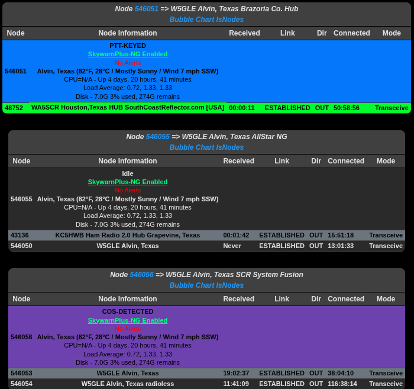

# Supermon-NG


 

Web dashboard for AllStar Link nodes — Vue 3 frontend, PHP 8.1+ API, WebSocket real-time updates with AMI polling fallback.

**Current release:** [V4.3.3](https://github.com/hardenedpenguin/supermon-ng/releases/tag/V4.3.3) (July 2026)

> **Install and upgrades:** Supermon-ng is moving to the **Debian `.deb` package** for new installs and updates. Use the [hardenedpenguin APT repository](https://hardenedpenguin.github.io/hardenedpenguin-apt/) (`apt install supermon-ng`) or install a `.deb` from [Releases](https://github.com/hardenedpenguin/supermon-ng/releases). The tarball **`install.sh`** and **`update.sh`** flows are **deprecated** — they remain for legacy sites but are no longer supported. Tarball `update.sh` in particular does not reliably deploy new privileged scripts (for example announcements `announce-*.sh` and sudoers). See [docs/DEBIAN.md](docs/DEBIAN.md). Existing tarball installs should [migrate to apt](docs/DEBIAN.md#migrating-from-tarball-installsh-to-apt) rather than run `update.sh` again.

## Features

- **Real-time monitoring** — WebSocket node status; AMI polling when WS is down
- **Setup wizard** — First-run guide: admin account, `global.inc` site identity, `allmon.ini` generation
- **Operations** — Service health panel, config backup/restore, link map, connection status bar
- **Node control** — Connect, monitor, DTMF, favorites, control panel (permission-gated)
- **DVSwitch** — Mode/talkgroup switching; credentials stay server-side
- **System tools** — CPU/memory/disk, logs, config editor, custom themes and header images
- **Multi-node** — One dashboard for many nodes from `allmon.ini`

## Requirements

- Debian 11+ / Ubuntu 20.04+ (ASL3+), Asterisk with AllStar
- PHP 8.1+ (`sqlite3`, `curl`, `mbstring`, `json`, `zip`)
- Apache 2.4+ (`rewrite`, `proxy`, `proxy_http`, `proxy_wstunnel`, `headers`, `ssl`)
- ~512MB RAM, ~200MB disk

## Install

**APT repository (recommended):** one-time setup adds the signing key and `sources.list` entry ([hardenedpenguin-apt](https://github.com/hardenedpenguin/hardenedpenguin-apt)). Supports `amd64` and `arm64`.

```bash
cd /tmp
curl -fsSLO https://hardenedpenguin.github.io/hardenedpenguin-apt/pool/main/h/hardenedpenguin-archive-keyring/hardenedpenguin-archive-keyring_1.0_all.deb
sudo apt install ./hardenedpenguin-archive-keyring_1.0_all.deb
sudo apt update
sudo apt install supermon-ng
```

**Or** download `supermon-ng_*_all.deb` from [Releases](https://github.com/hardenedpenguin/supermon-ng/releases) (built on each version tag) and install locally — see [docs/DEBIAN.md](docs/DEBIAN.md) for build-from-source.

```bash
sudo apt install ./supermon-ng_*_all.deb
# or: sudo dpkg -i supermon-ng_*_all.deb && sudo apt-get install -f
```

Apache is configured automatically (debconf can opt out). On a **fresh install**, `postinst` can generate `user_files/allmon.ini` from local `rpt.conf` + `manager.conf`.

Open `https://your-host/supermon-ng/` — the **setup wizard** walks through admin creation, `global.inc`, and node setup. Existing sites skip the wizard once complete.

<details>
<summary><strong>Deprecated: tarball + install.sh</strong></summary>

Not recommended for new deployments. May miss package-managed files (sudoers, systemd, `user_files/sbin` scripts).

```bash
wget https://github.com/hardenedpenguin/supermon-ng/releases/download/V4.3.3/supermon-ng-V4.3.3.tar.xz
tar -xJf supermon-ng-V4.3.3.tar.xz
cd supermon-ng
sudo ./install.sh
```

</details>

### URL base path

Set `APP_BASE_PATH` in `/var/www/html/supermon-ng/.env`, then reconfigure Apache:

```bash
sudo dpkg-reconfigure supermon-ng
# or: sudo OVERWRITE_SITE=true /var/www/html/supermon-ng/scripts/configure-apache.sh configure
```

| Value | Layout | Example |
|-------|--------|---------|
| `/supermon-ng` (default) | Subdirectory under document root | `https://host/supermon-ng/` |
| `/` | Dedicated vhost at site root | `https://sm.example.com/` |

For a root vhost, also set `SUPERMON_SERVER_NAME` and `SSL_CERT_NAME` in `.env`, merge `apache-config-template.conf` into your live vhost, and reload Apache.

## Update

**APT repository (recommended):** after the [one-time repo setup](#install) above:

```bash
sudo apt update
sudo apt install supermon-ng
```

`apt` / `dpkg` preserve conffiles under `user_files/` and prompt when maintainer configs change (for example sudoers).

**Or** install a newer `.deb` from [Releases](https://github.com/hardenedpenguin/supermon-ng/releases):

```bash
sudo apt install ./supermon-ng_*_all.deb
```

Tarball sites should [migrate to apt](docs/DEBIAN.md#migrating-from-tarball-installsh-to-apt) instead of using `update.sh`.

<details>
<summary><strong>Deprecated: tarball + update.sh</strong></summary>

Do not use on sites that can move to the `.deb`. `update.sh` preserves the existing `user_files/sbin/` tree and may skip new privileged scripts.

```bash
cd $HOME
wget https://github.com/hardenedpenguin/supermon-ng/releases/download/V4.3.3/supermon-ng-V4.3.3.tar.xz
tar -xJf supermon-ng-V4.3.3.tar.xz
cd supermon-ng
sudo ./scripts/update.sh
```

Options: `--skip-apache`, `--force` (re-apply same version).

</details>

```bash
sudo /var/www/html/supermon-ng/scripts/version-check.sh
```

## Configuration

| File | Purpose |
|------|---------|
| `user_files/allmon.ini` | Nodes and AMI (`[nodeid]` stanzas) |
| `user_files/global.inc` | Callsign, titles, colors, welcome text |
| `user_files/authusers.inc` | Per-button permissions |
| `user_files/.htpasswd` | Login accounts |
| `user_files/dvswitch_config.yml` | DVSwitch modes/talkgroups (copy from `.example`) |
| `user_files/sbin/node_info.ini` | Node status / weather (or use Node Status UI) |

**Users:** `sudo ./scripts/manage_users.php add|list|change|remove`

**Regenerate `allmon.ini` from Asterisk:** `sudo php scripts/generate_local_allmon.php --force` (backs up first)

**Permissions** in `authusers.inc`: `$CONNECTUSER`, `$MONUSER`, `$FAVUSER`, `$DVSWITCHUSER`, `$CFGEDUSER`, `$SYSINFUSER`, `$CTRLUSER`, etc. Replace default `anarchy` with your username.

**Announcements (V4.3.0+):** upload, TTS, local/global playback, and cron scheduling — see [docs/ANNOUNCEMENTS.md](docs/ANNOUNCEMENTS.md) for permissions, EchoLink/global playback notes, and troubleshooting.

**Optional:** `header-background.jpg` in `user_files/`; GPS weather via `saytime_weather` / `weather.rb --gps` in node status settings.

## Services & logs

```bash
sudo systemctl status supermon-ng-backend supermon-ng-websocket apache2
sudo systemctl restart supermon-ng-backend supermon-ng-websocket
sudo systemctl status supermon-ng-node-status.timer
```

**Node status timer:** `supermon-ng-node-status.timer` runs `ast_node_status_update.py` every **5 minutes** by default (weather, alerts, etc.). To change the interval, set `NODE_STATUS_INTERVAL_MINUTES` in `.env` before install or upgrade, then `sudo systemctl daemon-reload` and restart the timer (on apt installs, the package applies the drop-in on configure).

| Log | Location |
|-----|----------|
| Apache | `/var/log/apache2/supermon-ng_*.log` |
| App | `/var/www/html/supermon-ng/logs/app-YYYY-MM-DD.log` |
| Backend / WS | `journalctl -u supermon-ng-backend` / `supermon-ng-websocket` |

Hard-refresh the browser after upgrades so the latest frontend loads.

## Troubleshooting

| Symptom | Check |
|---------|--------|
| Site down / 502 | `systemctl status apache2 supermon-ng-backend`; Apache error log |
| WS fallback / no live updates | `systemctl restart supermon-ng-websocket`; `a2enmod proxy_wstunnel` |
| AMI errors | Asterisk running; `manager.conf` matches `allmon.ini` |
| Permissions | `chown -R www-data:www-data /var/www/html/supermon-ng`; ACL on `/var/log/asterisk/` |

## Security notes

- Session auth with CSRF on state-changing API calls
- Role-based UI and API enforcement via `authusers.inc`
- DVSwitch and system actions require explicit permission flags
- Unauthenticated users get no capabilities until login
- `CORS_ORIGINS` should list explicit origins in production (not `*` with credentials)

## Contributing & support

PRs welcome (PSR-12 PHP, ESLint for frontend). Report issues at [GitHub Issues](https://github.com/hardenedpenguin/supermon-ng/issues) with PHP version, relevant log lines, and reproduction steps.

## License

MIT — see [LICENSE](LICENSE).
